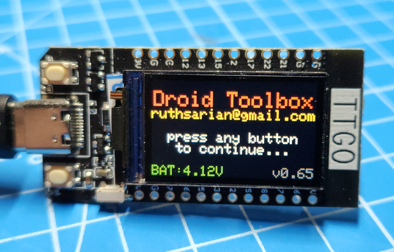
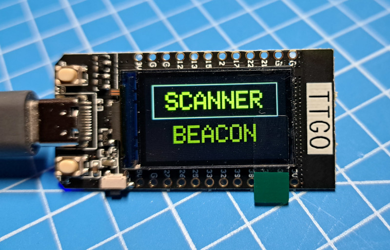
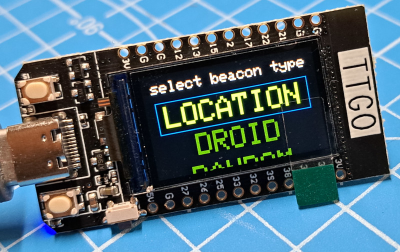
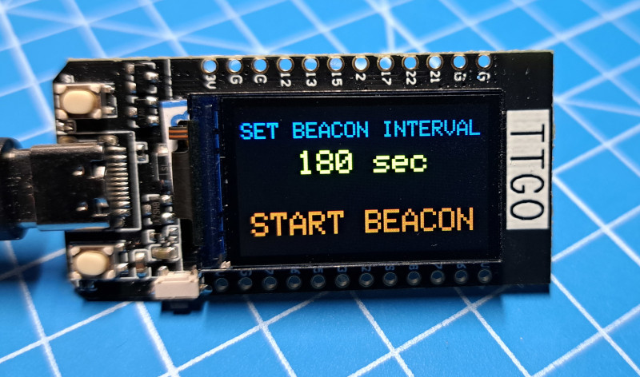
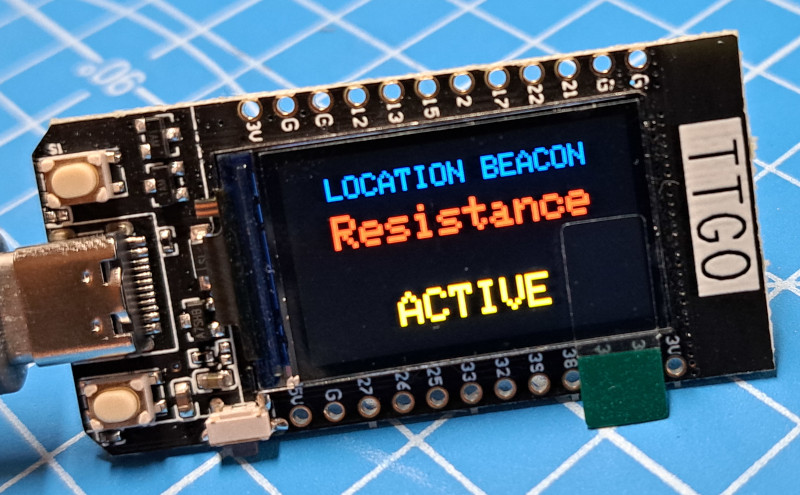
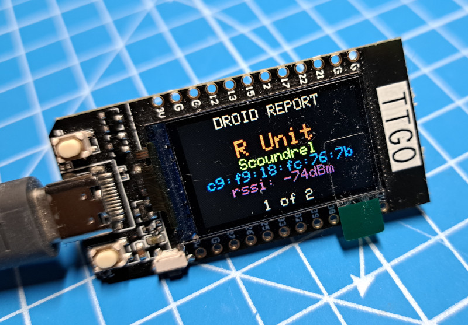
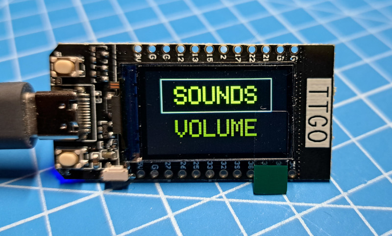
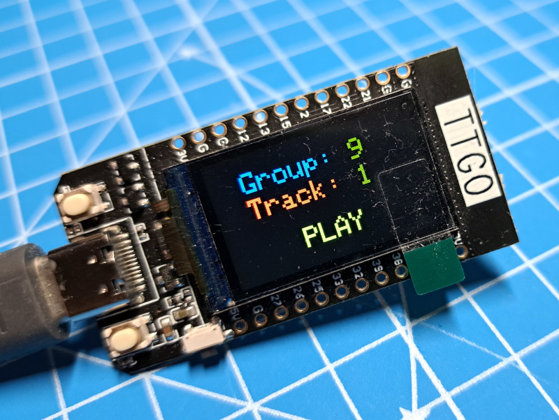

# Droid Toolbox - v0.71
This is an [Arduino IDE](https://www.arduino.cc/en/software) sketch for ESP32-based devices to interact with [Galaxy's Edge droids](https://disneyworld.disney.go.com/shops/hollywood-studios/droid-depot/). It can emit a bluetooth beacon that droids will react to, scan for nearby droids, and connect to droids and command them to play specific audio tracks from their personality chip. A YouTube video of the Droid Toolbox in action is available at https://www.youtube.com/watch?v=0sHTIEbTevk.

This code was specifically designed for [LILYGO TTGO T-Display](https://www.lilygo.cc/products/lilygo%C2%AE-ttgo-t-display-1-14-inch-lcd-esp32-control-board) and [LILYGO T-Display-S3](https://www.lilygo.cc/products/t-display-s3) devices and may not display correctly on other ESP32 devices without modification.

*Use at your own risk.*

## Features
* Select between emitting a beacon or scanning for nearby droids.
* The emitted beacon can be selected/customized.
* Emitted beacons can automatically change at a pre-defined interval.
* Connect to droid and make is play a specific track from a specific audio group.
* Change the volume level of the droid.
* Select from several different font styles.
* Auto shut-off.

## Setup and Installation
### Video Tutorials
* This YouTube video (https://www.youtube.com/watch?v=wEwg2-N3HqM) provides instructions on the process of setting up the Arduino environment, installing the Arduino ESP32 core and libraries, downloading the Droid Toolbox code, and programming a T-Display and T-Display-S3 with the Droid Toolbox software. 
* This follow-up video (https://www.youtube.com/watch?v=kiu0b0Uf0Nw) provides instructions on this process from a MacOS perspective.

### Resources
* [LilyGo TTGO T-Display GitHub Repository](https://github.com/Xinyuan-LilyGO/TTGO-T-Display) - Contains links to drivers, setup instructions, and sample code
* [LilyGo T-Display-S3 GitHub Repository](https://github.com/Xinyuan-LilyGO/T-Display-S3/)
* [Arduino IDE Software](https://www.arduino.cc/en/software)
* [ESP32 Core for Arduino](https://github.com/espressif/arduino-esp32)
* [TFT_eSPI Library](https://github.com/Bodmer/TFT_eSPI)
* [OpenFontRender](https://github.com/takkaO/OpenFontRender)

## Button Labeling / TTGO Orientation

* Droid toolbox is designed to be operated with the TTGO held horizontally with the USB port on facing the left.
* The button at top-left (above the USB port) is Button 1.
* The button at the bottom-left (below the USB port) is Button 2.

## Operation

* At startup the droid toolbox displays a splash screen.
* While at the splash screen you can change the display font used by the droid toolbox.
* To change the font press and hold the button 1 for at least 1 second then release it.
* The splash screen will refresh in the new font. 
* Droid Toolbox comes with 4 variations on the Aurebesh font.

* Press either button 1 or 2 to enter the main menu.
* Press button 2 to change options in the main menu.
* Press button 1 to select the highlighted option from the main menu.

### Button Press Types
* A button press is not registered until the button is released.
* Droid toolbox detects short and long button presses.
* A short press is any press in which the button is held down for less than 500ms.
* A long press is any press that lasts for 500ms or longer.
* If a button press type is not explicitly stated in the instructions below, either press type applies.

### Beacons
* A short button 2 press will scroll through the available beacon options
* A button 1 press will select that option
* A long button 2 press will return to the previous menu

* First select a beacon type
  * **Location** beacons represent different areas of Galaxy's Edge
  * **Droid** beacons represent individual droids and their current personality chip
  * **Random** will select a beacon at random
  * **Rotating** randomly select and activate a location beacon at a preset interval
  * **Expert** For those who want to experiment

* If you selected location or droid, select the location or droid beacon you would like to emit.

'
* If you selected rotating, set the interval between beacon changes. This can be any value from 60 to 1440 seconds. A short button 1 press increases the interval by 10 seconds. A long button 1 press increases the interval by 100 seconds.
* Once you've set the interval you want, short press button 2 to highlight 'start beacon' then press button 1 to start the rotating beacons.
* When in rotating beacon mode, a countdown is displayed in the lower-right corner of the display.

* Once your beacon is selected you'll be shown a screen identifying the beacon and whether or not it is active.
* To activate the beacon, press button 1. 
* To deactivate the beacon, press button 1 again.
* To exit this beacon, long-press button 2.

* In expert mode you have control over all the key values that are part of a beacon.
  * **TYPE** The beacon type; either droid or location
  * **LCNT** for location beacons; the location ID. if the ID is known the name is displayed, otherwise the numerical value is displayed
  * **REACT INT** for location beacons; how many minutes a droid will wait before reacting to the beacon
  * **MIN RSSI** for location beacons; the minimum RSSI (received signal strength indicator) the droid must detect of the beacon in order to react to it
  * **CHIP** for droid beacons; the ID of the personality chip; names of known personality chips will be displayed, otherwise the numerical value is displayed
  * **AFFL** for droid beacons; the droid's affiliation (scoundrel, resistance, first order), if you don't pick a known affiliation, the numerical value is displayed
  * **PAIRED** for droid beacons; indicates if the droid is paired with a remote or not
  * **STATE** whether or not the beacon is active
* To navigate, short-press button 2 to move through the different settings of the beacon.
* Short-press button 1 to change the current value of a setting.
* Long-press button 1 to reset a parameter to it's lowest value
* Long-press button 2 to exit expert mode
* Don't get cocky

### Scanning

* Upon selecting the scanner option a scan is initiated. After a few seconds the results of the scan are displayed
* If no droids are detected, a message will be displayed.
* If more than one droid is detected, a button 1 short press will step to the next droid in the results.
* A button 1 long press will cause the droid toolbox to attempt to connect to the droid.
* A button 2 press will return to the main menu.

### Connected

* If the connection attempt fails, be sure your droid's remote is turned off and that the droid is still on.
* Once connected to a droid a menu is displayed letting you select between playing SOUNDS from the droid's personality chip and managing the droid's VOLUME.
* A button 1 press will select the highlighted menu item.
* A button 2 short press will step through the menu items.
* A button 2 long press will disconnect from the droid and return to the droid scan results.

### Playing Sounds

* The SOUNDS option allows you to play a selected track from a selected group within a droid's personality chip. Droids that don't have a personality chip installed still have an internal personality chip from which tracks are played.
* A button 1 short press will increment GROUP or TRACK depending on which is highlighted. If PLAY is highlighted, it will command the droid to play the selected track from the selected group.
* A button 1 long press will either move to the next option (TRACK or PLAY) or play the track when PLAY is highlighted. *This behavior will be changed in a future update.*
* A button 2 short press will step through the options to select a group number, a track number, and play.
* A button 2 long press will exit from SOUNDS screen and return to the previous menu.

### Volume Control

* The VOLUME option allows you to set the volume level of the sounds played through the droid. 
* Volume can be set between 0 and 100 in increments of 10. 
* There is no way to read the current volume level of a droid. Upon first connection to a droid, Droid Toolbox will assume a volume level of 100, but it may not represent the actual volume level of the droid until you set the volume level.
* A button 1 press will execute the highlighted action: volume increase (VOL+), volume decrease (VOL-), and SET VOLUME. The SET VOLUME option must be used to set the droid's volume to the currently selected value. If you do not SET VOLUME the droid's volume will not be changed.
* A button 2 short press will step through the options VOL+, VOL-, and SET VOLUME. The currently selected option will appear in green text.
* A button 2 long press will exit from VOLUME screen and return to the previous menu.

### Auto Shut-Off
Droid-toolbox will go to sleep after 5 minutes of inactivity. It will not sleep if a beacon is active. To restart the droid toolbox press the reset button.

### T-Display-S3 Supported

The LilyGo T-Display-S3 is like the LilyGo TTGO T-Display, but with a larger screen and more program space. The Droid Toolbox code will work with either a T-Display or T-Display-S3 without the need to modify any of the code. 

## About Audio Tracks
Galaxy's Edge droids have [personality chips](https://plandisney.disney.go.com/question/dose-droid-personality-406556/). Droids come with a built-in personality chip, but can be modified by plugging in an extra personality chip which overrides the internal personality chip. The personality chip is a collection of audio clips which play when a droid reacts to location beacons, nearby droids, or button presses on the droid's remote control. The audio clips are divided into 12 separate groups. The first 7 groups represent 7 areas within Galaxy's Edge and are what plays when a droid reacts to a beacon. Group 8 through 12 contain special audio clips used with droid accessories (for R-units) and special circumstances, such as when a droid is first activated inside Droid Depot. 

Droid Toolbox allows you to select between the 12 groups and select an audio track within that group. The number of audio clips for a given group can vary between personality chips. While we know how many clips there are for stock personality chips, custom personality chips could have as many audio clips as you want. As such you'll be able to select up to audio track 99, even though the number of tracks typically doesn't go beyond 6. If you try to play an audio track number that doesn't exist the droid will simply do nothing.

### Audio Groups and Their Uses
|Group|Purpose|
|---|---|
|1|Location: Market Area|
|2|Location: [Droid Depot](https://disneyworld.disney.go.com/shops/hollywood-studios/droid-depot/)|
|3|Location: Resistance Area|
|4|Location: Unknown \*|
|5|Location: Alert \*\*|
|6|Location: [Dok-Ondar's Den of Antiquities](https://disneyworld.disney.go.com/shops/hollywood-studios/dok-ondars-den-of-antiquities/)|
|7|Location: First Order Area|
|8|Droid Activation|
|9|Unused R-unit Accessory|
|10|Unused and Empty|
|11|Blaster R-Unit Accessory|
|12|Thruster R-Unit Accessory|

*\* No location beacon for this value has been seen inside Galaxy's Edge*

*\*\* Seen at the entrance to [Oga's Cantina](https://disneyworld.disney.go.com/dining/hollywood-studios/ogas-cantina/); possibly the droid detectors? Also seen near Ronto Roasters and the area between Droid Depot and First Order.*

## References
* [Controlling Disney’s Droids from Droid Depot with WebBluetooth](https://medium.com/@baptistelaget/controlling-disneys-droids-from-droid-depots-with-webbluetooth-febbabe50587)
* [bashNinja's BLE scan from Galaxy's Edge](https://discord.com/channels/478345594641973248/596058282087546968/626179189115977748) shared with the #makerspace channel of the [Galaxy's Edge Discord Server](http://swgediscord.com)
* [Dead Bothans Society Beacon Map](https://docs.google.com/spreadsheets/d/1zIZb7uUxUe7ewypnTGrzrX1FA85U5mn2XtULZbcXqI8/edit#gid=0)
* [VProFX's Interactive Map of Beacon Locations](http://galaxysedgetech.epizy.com/?i=1)
* [Galaxy's Edge Research - Bluetooth Beacons](https://docs.google.com/spreadsheets/d/13P_GE6tNYpGvoVUTEQvA3SQzMqpZ-SoiWaTNoJoTV9Q/edit#gid=372067469)
* [YohanUM's Beacon Location Data](https://www.google.com/maps/d/edit?mid=1pdCcMcTHQzcOOTIz-Lv1uYqqjWI-jDQ)
